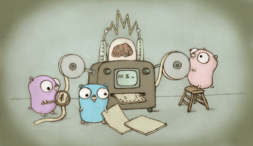

# image-splitter
A CLI tool which splits an image into Red-Green-Blue-Alpha channels

## How to Use
`image-splitter /file/path/to/source-image.png`

The command will create the following files in the same directory

- `source-image-red.png`
- `source-image-green.png`
- `source-image-blue.png`
- `source-image-alpha.png`

### Options
TODO

## Example
Original image by [Renee French](https://reneefrench.blogspot.com/), licensed under [Creative Commons 3.0 Attributions license](https://creativecommons.org/licenses/by/3.0/), modified by the author of this program (resized, and converted from JPEG into PNG)

The red channel looks like following. White means red color is bright, and black means red color is dark.

## License
MIT License, except the images above (stored in `examples` directory in this repository).
See [LICENSE.md](./LICENSE.md) for more details.

## Development Environment
Go 1.17 is required

## Development Operations
- `go build image-splitter.go` to build executable, named `image-splitter`
- `go run image-splitter.go` to execute
